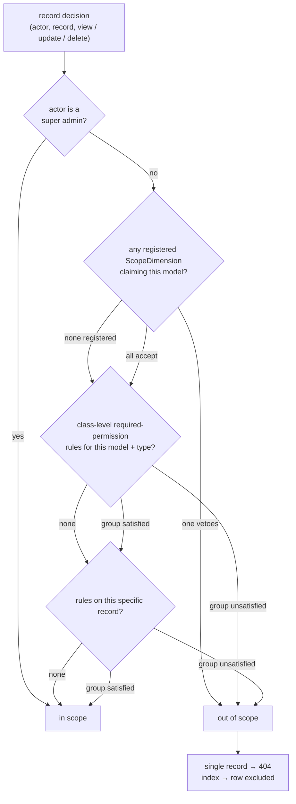
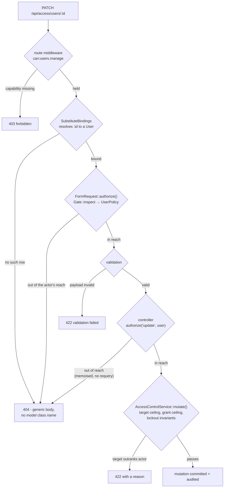

# Record scoping

How the access layer decides which *records* a user may see and touch, once role-based access control has already
decided what *kinds* of things they may do. Reference material for the underlying vocabulary and invariants lives
in [access-control.md](access-control.md); this document explains the record-level machinery and how to build on it.

## Three layers, three owners

Record access composes three independent answers. Each is defined in a different place, changed at a different cadence,
and none of them knows about the others:

| Layer                     | Answers                                        | Defined by                     | Changed by                |
|---------------------------|------------------------------------------------|--------------------------------|---------------------------|
| Permissions               | "may you do this kind of thing at all?"        | code (seeder vocabulary)       | deploy                    |
| Scope dimensions          | "which slice of the records?"                  | code (one class per dimension) | data (assignment rows)    |
| Required-permission rules | "does this class or record demand extra keys?" | admin UI, at runtime           | any `roles.manage` holder |

A request must pass every layer that has an opinion. Super admins bypass all three.

## How a decision is evaluated

Nothing here is a global scope - endpoints opt in explicitly, so queue jobs and console commands that never ask are
unaffected by construction. A protectable model opts in by using the
`HasRequiredPermissions` trait, which provides both forms of the question:

- **Index queries** call `Model::visibleTo($user, $type)`. The scope adds each registered dimension's `constrain()`
  clause to the query, evaluates class-level rules in PHP (short-circuiting to an empty result on failure), and appends
  record-rule subqueries only when the class has record rules at all. Filtering happens in SQL; no per-row PHP.
- **Single records** call `$model->userCan($user, $type)`, which delegates to
  `AccessScope::allowsRecord()`: super-admin bypass, then each dimension's `allows()` veto, then class-level rules, then
  the record's own rules. Out-of-scope records surface as 404, not 403, so identifiers are not probeable.

Both forms must agree - `constrain()` narrows index queries to exactly the records `allows()` would accept. That
symmetry is the one law of the `ScopeDimension` contract.

Both forms walk the same ladder, in the same order. Only the mechanism differs: `visibleTo()` expresses each rung as
SQL, `allowsRecord()` evaluates it in PHP and memoises the verdict for the request.

**Read the stock configuration off that diagram:** with `access.dimensions = []` and no `required_permissions` rows,
every diamond takes its *none* branch and the answer is always **in scope**. That is why wiring `UserPolicy` into the
admin surface changed no behaviour - the ladder is connected, but every rung is currently a pass-through. Registering
one dimension activates the second diamond, and the whole surface narrows at once.

## What is wired today - the admin user surface

Because nothing here is a global scope, a dimension only binds the surfaces that ask. The shipped worked example is
the **admin user surface**: `User` uses `HasRequiredPermissions`, `Policies\UserPolicy` (extending
`Policies\ResourcePolicy`) is registered for it, and everything under `/api/access/users` asks:

- **Reads and mutations on one record** - show, edit, delete, role/permission sync, force reset, resend invitation,
  two-factor reset, per-user sessions and logs - authorize per record through the policy. The record-bound form
  requests answer the same verdict in `authorize()`, before validation, so an out-of-scope id can never leak a 422
  where an unknown id answers 404.
- **The index, the CSV export and the stats counts** flow through one `visibleTo()` builder, so the list, the file
  and the numbers cannot diverge; the stats totals count only the actor's slice.
- **Membership** passes a match - live or retired - through `userCan()` and answers `none` for an out-of-scope
  account, exactly like an unknown address. One caveat holds: membership does not confirm an out-of-scope account,
  but *creation still collides* - emails are globally unique, so POSTing that address answers a 422 "already taken".
  Non-enumeration is therefore not preserved end to end across scope boundaries.
- **Impersonation** - `ImpersonationService` refuses a target `UserPolicy::impersonate` vetoes (the same
  `allowsRecord()` composition), then applies its stricter tier rule on top.
- **Creation is deliberately not scoped.** `POST /api/access/users` has no record to scope, and dimensions do not
  constrain creation *into* a slice. The consequence: a created account is reachable afterwards only if the
  dimension's axis places it in the creator's slice - otherwise the 201 (and its one-time temporary password, when
  that delivery was chosen) is the last the creator sees of it.

Out-of-scope records answer the same 404 an unknown id produces (`denyAsNotFound()`), body-identical apart from the
per-request `instance` id.

Four separate gates stand between a request and a mutation, and each rejects with a different status. The order is the
security-relevant part: **authorization answers before validation**, so a malformed payload aimed at an out-of-scope id
cannot come back 422 where an unknown id comes back 404.

Two distinctions that diagram is worth having for:

- **403 vs 404.** A missing *capability* is a 403: you may not do this kind of thing, and saying so leaks nothing. A
  record outside your *reach* is a 404: admitting it exists would make the id space probeable.
- **404 vs 422.** Reach is decided by the policy and answers 404. Rank is decided by the service's ceilings and answers
  422 with a reason - by then the record is known to be in reach, so naming the obstacle is safe. Reach precedes rank,
  never the reverse.

Gate 3 exists only where the route binds a record-aware form request - `UserAccountUpdateRequest`,
`SyncUserRolesRequest`, `SyncPermissionsRequest`, `AuthenticationLogIndexRequest`. Those are exactly the routes that
validate a payload or query string, which is why they are the ones that need the verdict *before* validation. The
remaining record routes take a plain `Request` and are covered by gate 4 alone; reads skip validation and the service
entirely, ending at `authorize('view', …)`.

The tier ceilings (`AccessControlService`'s grant and target checks) are a separate layer and unchanged: they answer
rank, the scope answers reach, and a mutation must pass both. A deployment adds its axis by registering a
`User`-claiming dimension - the surface is already listening.

**Dimensions must answer for soft-deleted records too.** The admin read routes resolve tombstoned accounts
(`withTrashed()` bindings) so deletion audit entries stay readable, and the stats counter combines the scope with
`onlyTrashed()`. `AccountRetirementService` severs credentials and tombstones the email but does not clear
application columns; if a dimension's axis attribute can be null or unreadable on a retired record, fail closed
(deny) rather than defaulting to visible.

## Scope dimensions

A dimension is an application-defined visibility axis (tenant, region, department) registered in
`config/access.php` `dimensions` and resolved from the container. The interface is three methods:
`appliesTo()` declares jurisdiction over a model class, `constrain()` narrows an index query,
`allows()` vetoes one record.

The capability/reach split is the point: roles and permissions never mention the axis, and the axis never mentions
permissions. Ten county operators share one role; only their assignment rows differ. Widening or narrowing a user's
reach is data entry, not an access mutation.

### Walkthrough: limiting users to one county's precincts

1. **Data.** Precincts carry `county_id`; a `county_user` pivot records which counties a user is assigned. The pivot is
   the only place the limitation lives.
2. **The dimension.** A `CountyDimension` implements the contract: `appliesTo()` claims `Precinct`,
   `constrain()` adds `whereIn('county_id', ...)` from the actor's pivot rows (memoized per request), `allows()` is the
   same membership test for one record.
3. **Wiring.** `Precinct` uses `HasRequiredPermissions`; its index endpoints call `visibleTo()`, its single-record
   endpoints call `userCan()`. The dimension class is listed in
   `access.dimensions`.
4. **Per user, forever after.** Grant `precincts.view` through a role, insert the assignment row. No new roles,
   permissions or code per user.

Extending the same axis to another model (users, stations) is one more `appliesTo()` case - the model inherits the
scoping everywhere the access layer is asked.

Two conventions keep dimensions safe:

- **Fail closed.** An actor with no assignment rows sees nothing. "Sees everything" must be an explicit marker (a
  per-user flag), never the absence of rows.
- **Scoping is reach, not capability.** A dimension never substitutes for the permission check; the policy/middleware
  capability gate runs regardless.

## Required-permission rules

Rules are the runtime-composable layer: rows in `required_permissions` managed from the admin record browser, each
saying "acting on this protectable requires holding that permission".

- `protectable_type` + `protectable_id` name the target - a null id covers every record of the class, an id locks one
  record.
- `type` is the guarded action, from the `rule_types` vocabulary (`view`/`update`/`delete`).
- `mode` combines rows into a group: every `all` row is individually required; `any` rows form a pool of which one must
  be held. An empty group passes.

Only models whitelisted in `access.protectables` can carry rules; the whitelist doubles as the admin API's validation
surface. Rules rewrite authorization outcomes the way role grants do, so the management endpoints sit under
`roles.manage`.

## Performance characteristics

The layer is built to cost almost nothing when unused and little when used. With no dimensions and no rules,
`visibleTo()` returns the builder unmodified - result sets are byte-identical to the unscoped query - at the price
of two memoized rule-table queries per request (plus the permission load the surface already needed):

- `constrain()` adds a WHERE clause to a query the endpoint was already running; the actor's assignment lookup is one
  indexed query per request, memoized.
- Class-level rules load in one grouped query per request; a second grouped query records which classes have record
  rules at all, letting `visibleTo()` skip its subqueries entirely in the common case. Record verdicts are memoized per
  user/record/action.
- `AccessScope` is a scoped singleton: every memo lives exactly one request, so revoking access is effective on the next
  request by construction - no TTL window, no cache invalidation, no persistent store.
- The deployment's job is ordinary database hygiene: index the scoping columns (`precincts.county_id`, the assignment
  pivot) like any tenant key.

A deployment with empty `dimensions` and `protectables` gets plain RBAC and pays none of this.
